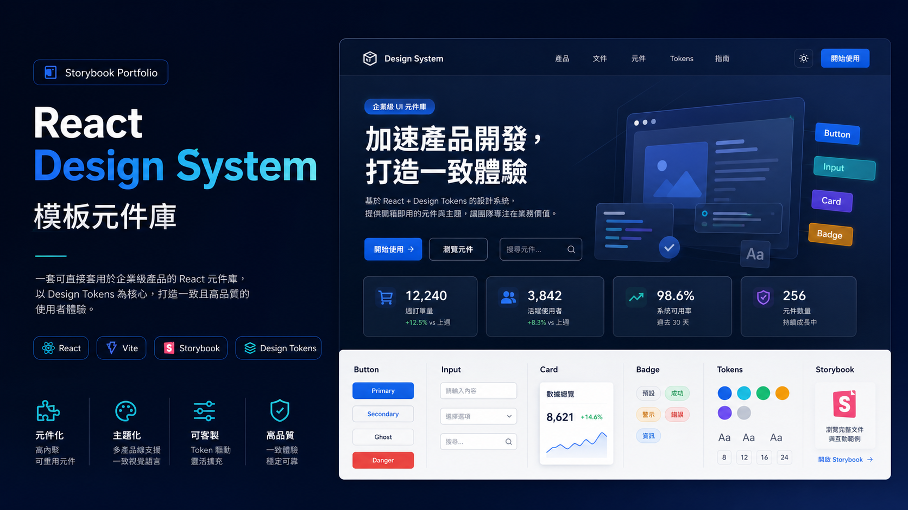

# My Design System



給小型內部產品用的 React 元件庫。21 個元件、4 條產品線 × 明暗兩套主題，
共用同一份元件程式碼；零執行期依賴。

```bash
npm install && npm run storybook
```

## 先看這幾頁

Storybook 開起來之後，這個順序最快看懂它做到什麼程度：

| 頁 | 看什麼 |
|---|---|
| `Showcase / 00 可操作的營運主控台` | **可以真的操作。** 表格排序分頁 → 每列的操作選單 → 對話框 → 表單驗證，建議把滑鼠放開只用鍵盤走一次 |
| `Showcase / 01–04` | 同一批元件換 `productLine` 就變成三個不同產品的版型 |
| `Components / Architecture` | 幾個「為什麼是這樣」：共用行為層、token 三層、打包顆粒度 |
| `Components / Accessibility` | library 保證什麼、使用端要自己做什麼 |
| `Foundation / Tokens` | 明暗兩套 token 並排，顯示實際計算值 |

右上角工具列可以切 Theme 與 Product line，對每個 story 都生效。

## 做到什麼程度

| | |
|---|---|
| 測試 | 127 個 story 測試，含 26 個 play function 覆蓋鍵盤流程 |
| 無障礙 | axe 在 CI 以 `error` 模式強制，違規會讓 `npm test` 失敗 |
| 對比度 | 4 條產品線 × 2 主題共 8 組文字全部通過 WCAG AA |
| Tree-shaking | 只 import 一個 `Button` 是 1.4 kB JS + 2.1 kB CSS；全部 import 是 45 kB + 30 kB。`npm run measure:bundle` 在 CI 守住這個數字 |
| 依賴 | 執行期 0 個，`react` / `react-dom` 是 peer |

## 元件

| 分類 | 元件 |
|---|---|
| 一般 | `Button`、`Icon` |
| 資料展示 | `Badge`、`Tag`、`Card`、`Tabs`、`Table` |
| 資料輸入 | `Input`、`Textarea`、`Select`、`Checkbox`、`Switch`、`Form`、`FormItem` |
| 回饋 | `Alert`、`Modal`、`Empty`、`Tooltip` |
| 導覽 | `Dropdown`、`Pagination` |
| 版面 | `Space` |
| 設定 | `ConfigProvider`（主題 / 產品線 / 語系 / 浮層容器）、`ThemeProvider` |

全部是 TypeScript、支援 `forwardRef`、各自匯出 prop 型別。
公開匯出集中在 `src/index.ts`。

## 主題

token 分三層，彼此不重疊 —— 這是 4 條產品線 × 2 個主題不需要手工維護
8 組色票的原因：

| 層 | 由誰控制 | 例子 |
|---|---|---|
| 尺度 | 固定 | `--spacing-md`、`--font-size-sm`、`--radius-md` |
| 品牌 | `[data-product-line]` | `--color-primary`、`--color-success` |
| 表面 | `[data-theme]` | `--color-surface`、`--color-text`、`--shadow-md` |

```tsx
<ConfigProvider global productLine="finance" theme="dark" locale={zhTW}>
```

`global` 讓主題屬性寫到 `<html>`，portal 出去的 `Modal` / `Tooltip` / `Dropdown`
才吃得到。彩色淺底（`Alert` / `Tag` / `Badge`）用 `color-mix()` 由品牌色與當前
表面色即時混出，同時跟著產品線與主題走。

自訂產品線與完整 API 見 Storybook 的 `Components / Getting Started`。

## 安裝

套件是 `@seanhong1215/my-design-system`，發布在 GitHub Packages 的私有
registry，不在公開 npm。需要一次性的認證設定 ——
**完整步驟與常見錯誤見 [`.docs/INTERNAL-ROLLOUT.md`](.docs/INTERNAL-ROLLOUT.md)。**

```bash
npm install @seanhong1215/my-design-system
```

**用 bundler 的話不需要 import 任何 CSS 檔** —— 每個元件都帶著自己的樣式。
沒有 bundler（UMD / CDN）時才需要整包的
`@seanhong1215/my-design-system/styles.css`。

`demo/product-a-demo` 是放在 repo 裡的真實消費端，它就是從 registry 安裝的，
`package.json` 本身即是接入範例。

## 指令

| | |
|---|---|
| `npm run storybook` | 文件站 |
| `npm run dev` | 消費端示範畫面（`src/App.tsx`） |
| `npm test` | 全部 story 測試 + axe |
| `npm run verify` | lint + typecheck + test + build，發版前的那道關卡 |
| `npm run build` | 打包 library |
| `npm run measure:bundle` | 印出 tree-shaking 的實測對照 |
| `npm run verify:pack` | 自建臨時消費端驗證打包正確性 |

## 文件

| 在哪 | 內容 |
|---|---|
| Storybook `Components / Getting Started` | 安裝、`ConfigProvider`、自訂產品線 |
| Storybook `Components / Accessibility` | 無障礙契約與已知限制 |
| Storybook `Components / Architecture` | 架構取捨與刻意沒做的事 |
| [`.docs/INTERNAL-ROLLOUT.md`](.docs/INTERNAL-ROLLOUT.md) | 內部試用指南、發布流程、CI |
| [`CHANGELOG.md`](CHANGELOG.md) | 版本變更；1.0 前破壞性變更落在 minor |

## 新增元件

```text
src/components/NewComponent/NewComponent.tsx    # 自己 import './NewComponent.css'
src/components/NewComponent/NewComponent.css
src/components/NewComponent/NewComponent.stories.tsx
```

`src/index.ts` 只加匯出，**不要**加 CSS import —— 加了會讓只用一個 `Button`
的使用端載入整包樣式，tree-shaking 就失效了。

其餘規範：class 一律 `mds-` 前綴並維持 BEM、用 `forwardRef` 並設
`displayName`、顏色一律取自 `src/tokens/tokens.css`。
